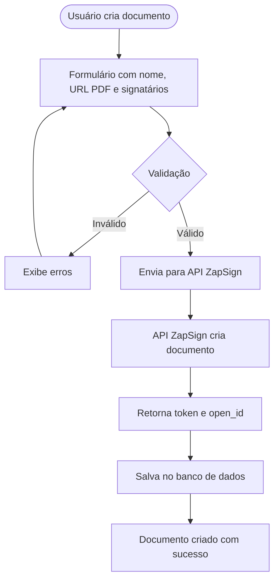
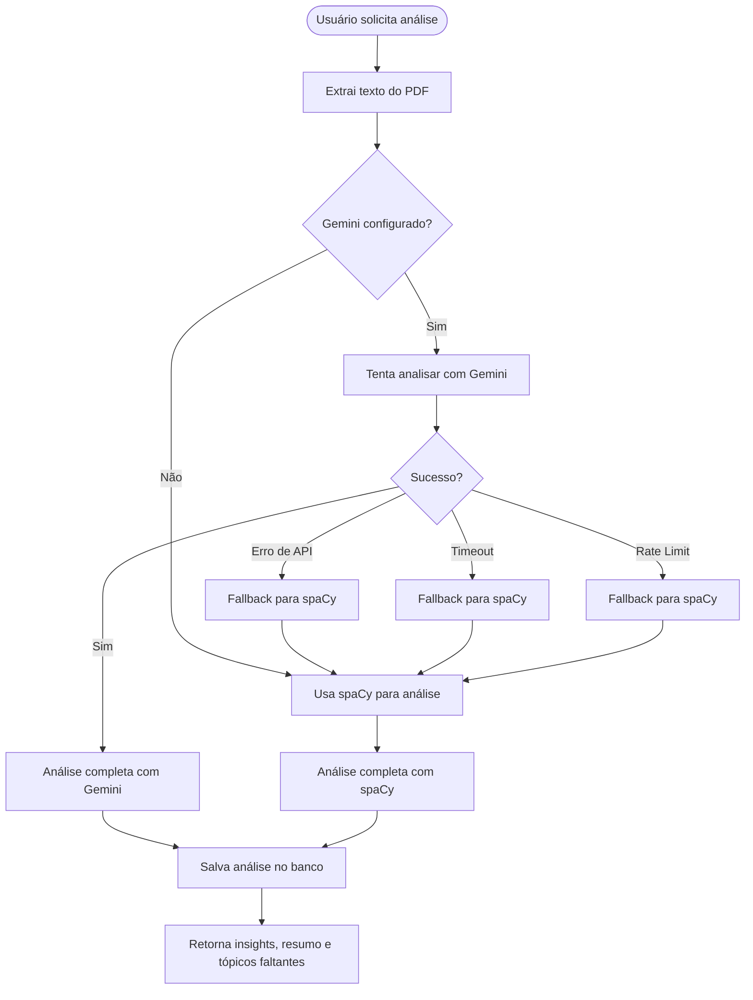
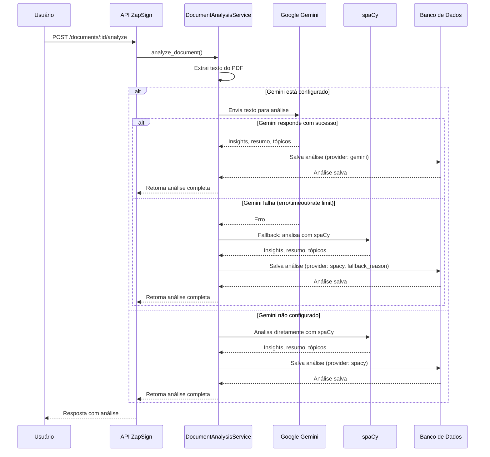
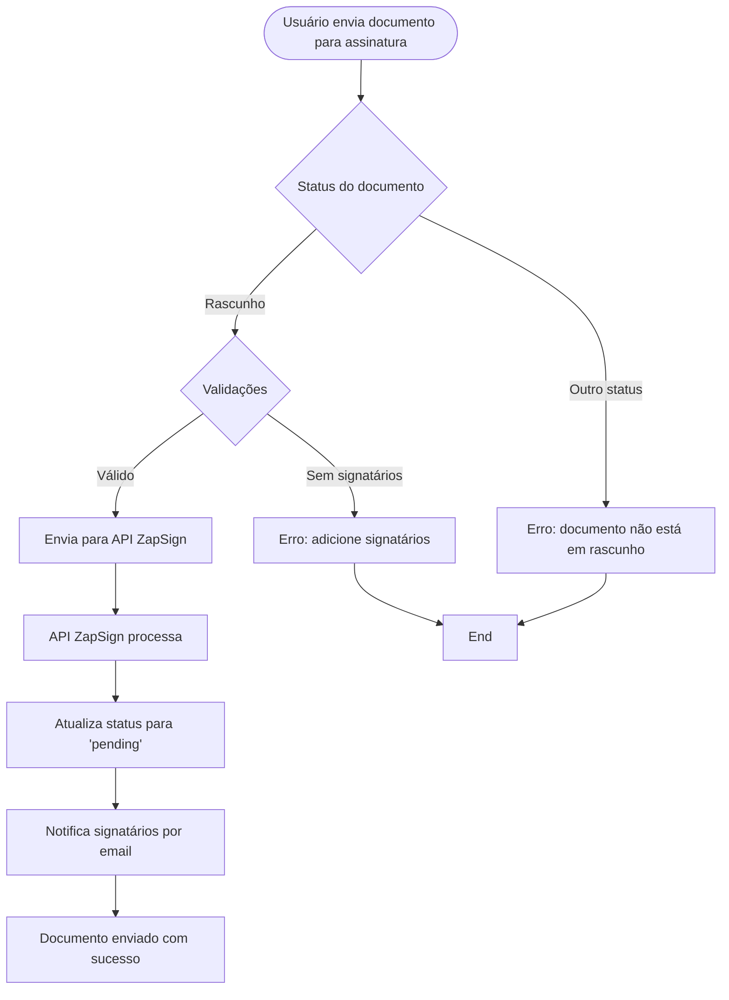
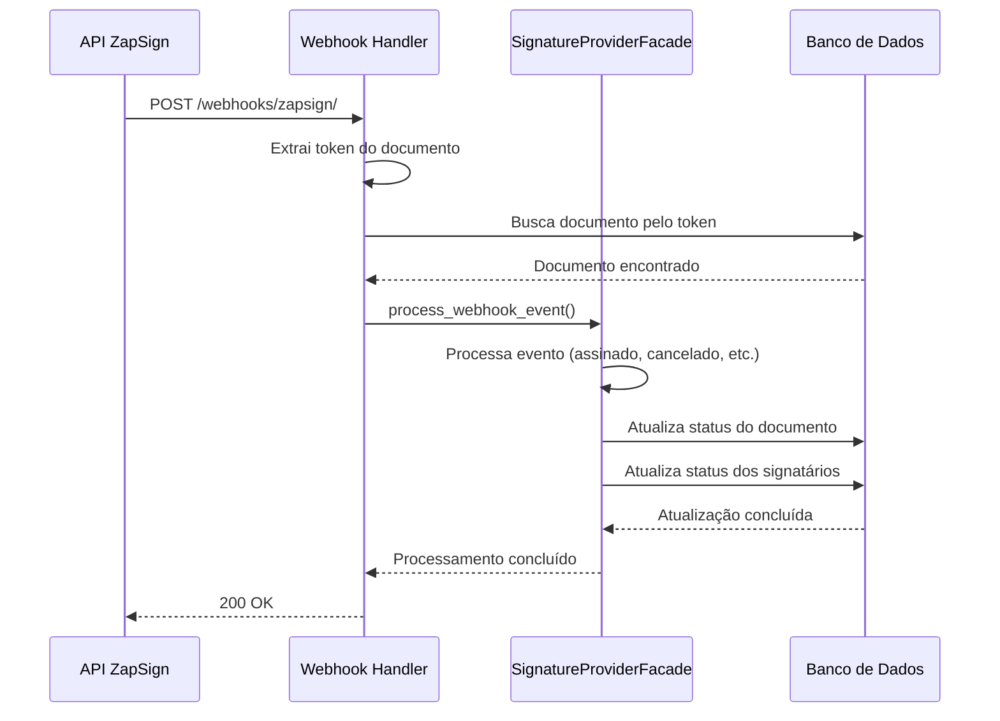

# ZapSign API

## 📋 Resumo Executivo

API RESTful desenvolvida em Django para gerenciamento de documentos e assinaturas digitais, com integração à API ZapSign e análise inteligente de conteúdo utilizando IA (spaCy e Google Gemini). A solução implementa uma arquitetura limpa (Clean Architecture) com separação de responsabilidades, permitindo que empresas clientes gerenciem documentos, signatários e obtenham insights automáticos sobre seus contratos.

### Principais Funcionalidades

- ✅ **CRUD Completo**: Gerenciamento de Companies, Documents e Signers
- ✅ **Integração ZapSign**: Criação automática de documentos na API ZapSign
- ✅ **Análise com IA**: Análise inteligente de documentos com identificação de tópicos faltantes, resumo e insights
- ✅ **Webhooks**: Recebimento de eventos dos provedores de assinatura
- ✅ **Métricas e Alertas**: Dashboard com métricas agregadas e alertas automáticos
- ✅ **Documentação Swagger**: API completamente documentada com Swagger/OpenAPI
- ✅ **Autenticação por Token**: Sistema seguro de autenticação via tokens
- ✅ **Testes Automatizados**: Cobertura de testes com Pytest

## 🚀 Links de Produção

- **API em Produção**: https://zapsign-api.onrender.com
- **Documentação Swagger UI**: https://zapsign-api.onrender.com/api/schema/swagger-ui/
- **Documentação ReDoc**: https://zapsign-api.onrender.com/api/schema/redoc/
- **Schema OpenAPI**: https://zapsign-api.onrender.com/api/schema/
- **Painel Admin Django**: https://zapsign-api.onrender.com/admin/
- **Health Check**: https://zapsign-api.onrender.com/health/

## 🛠️ Tecnologias Utilizadas

### Backend
- **Django 5.0+**: Framework web Python
- **Django REST Framework 3.14+**: Construção de APIs REST
- **PostgreSQL**: Banco de dados relacional
- **drf-spectacular**: Geração automática de documentação OpenAPI/Swagger

### Integrações
- **ZapSign API**: Integração com provedor de assinatura digital
- **spaCy**: Processamento de linguagem natural para análise de documentos
- **Google Gemini API**: Análise avançada de conteúdo com IA generativa
- **PyPDF2 & pdfplumber**: Extração de texto de arquivos PDF

### Testes e Qualidade
- **Pytest**: Framework de testes
- **pytest-django**: Integração Pytest com Django
- **pytest-cov**: Cobertura de código
- **pytest-mock**: Mocking para testes

### Infraestrutura
- **Docker**: Containerização
- **Gunicorn**: Servidor WSGI para produção
- **Render**: Plataforma de deploy (produção)

## 📦 Configuração Local

### Pré-requisitos

- Docker e Docker Compose instalados
- Git

## 🐳 Configuração com Docker (Recomendado)

### 1. Clone o Repositório

```bash
git clone <repository-url>
cd zapsign_api
```

### 2. Configure Variáveis de Ambiente (Opcional)

Crie um arquivo `.env` na raiz do projeto para personalizar as configurações:

```bash
# Banco de Dados
POSTGRES_DB=zapsign_db
POSTGRES_USER=zapsign_user
POSTGRES_PASSWORD=zapsign_pass

# Django
SECRET_KEY=sua-chave-secreta-aqui
DEBUG=True

# CORS
CORS_ALLOWED_ORIGINS=http://localhost:4200,http://localhost:3000

# Google Gemini (Opcional - para análise avançada)
GEMINI_API_KEY=sua-chave-gemini
GEMINI_ENABLED=True
GEMINI_MODEL=gemini-3-flash-preview

# ZapSign
ZAPSIGN_SANDBOX_URL=https://sandbox.api.zapsign.com.br
ZAPSIGN_PRODUCTION_URL=https://api.zapsign.com.br
```

> **Nota**: Se não criar o arquivo `.env`, o Docker Compose usará valores padrão.

### 3. Execute o Docker Compose

```bash
docker-compose up -d
```

Isso irá:
- Criar e iniciar o container do PostgreSQL
- Criar e iniciar o container do backend Django
- Aguardar o banco de dados ficar saudável antes de iniciar o backend

### 4. Execute as Migrações

```bash
docker-compose exec backend python manage.py migrate
```

### 5. Crie um Superusuário (Opcional)

```bash
docker-compose exec backend python manage.py createsuperuser
```

### 6. Instale o Modelo spaCy (Opcional, para análise de documentos)

Para análise de documentos com IA, instale o modelo spaCy:

```bash
# Modelo grande (recomendado - melhor qualidade)
docker-compose exec backend python -m spacy download pt_core_news_lg

# OU modelo pequeno (mais rápido, menor qualidade)
docker-compose exec backend python -m spacy download pt_core_news_sm
```

Após instalar, reinicie o container:

```bash
docker-compose restart backend
```

### 7. Acesse a API

A API estará disponível em: `http://localhost:8000`

- **Swagger UI**: http://localhost:8000/api/schema/swagger-ui/
- **ReDoc**: http://localhost:8000/api/schema/redoc/
- **Health Check**: http://localhost:8000/health/
- **Admin Django**: http://localhost:8000/admin/


## 🧪 Executando Testes

### Com Docker

```bash
# Executar todos os testes
docker-compose exec backend pytest

# Executar com cobertura
docker-compose exec backend pytest --cov=apps --cov-report=html

# Executar testes específicos
docker-compose exec backend pytest tests/test_views.py
```

## 🏗️ Arquitetura

O projeto segue os princípios de **Clean Architecture** com separação em camadas:

```
apps/
├── domain/          # Entidades e interfaces (camada de domínio)
│   ├── models/      # Modelos Django
│   └── interfaces/  # Interfaces/contratos
├── application/     # Casos de uso e lógica de negócio
│   ├── services/   # Serviços de aplicação
│   └── facades/     # Facades para integrações
├── infrastructure/  # Implementações concretas
│   ├── providers/  # Implementações de provedores
│   └── services/   # Serviços de infraestrutura
└── presentation/    # Camada de apresentação (API)
    ├── views/       # ViewSets e views
    ├── serializers/ # Serializers DRF
    └── urls/        # Rotas da API
```

## 🔐 Autenticação

A API utiliza autenticação por Token. Para obter um token:

```bash
POST /api/api-token-auth/
{
  "username": "seu_usuario",
  "password": "sua_senha"
}
```

Use o token retornado no header:

```
Authorization: Token <seu-token>
```

## 🔄 Fluxos da Aplicação

### Fluxo de Criação de Documento



### Fluxo de Análise de Documento com IA

Este fluxo mostra como a API analisa documentos usando Google Gemini com fallback automático para spaCy:



### Fluxo Detalhado: Análise com Gemini e Fallback



### Fluxo de Envio para Assinatura



### Fluxo de Webhook



